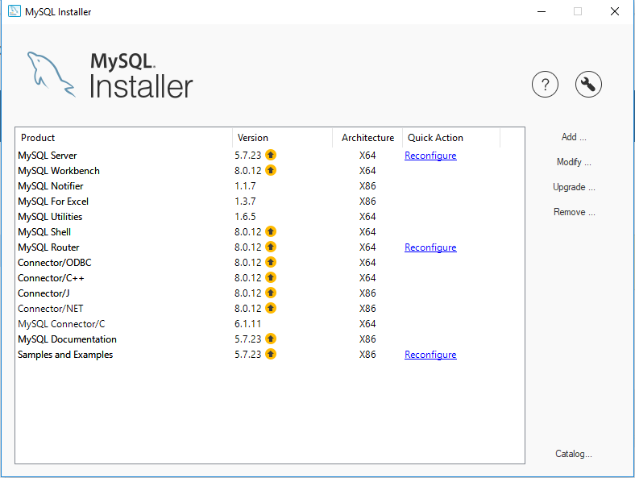
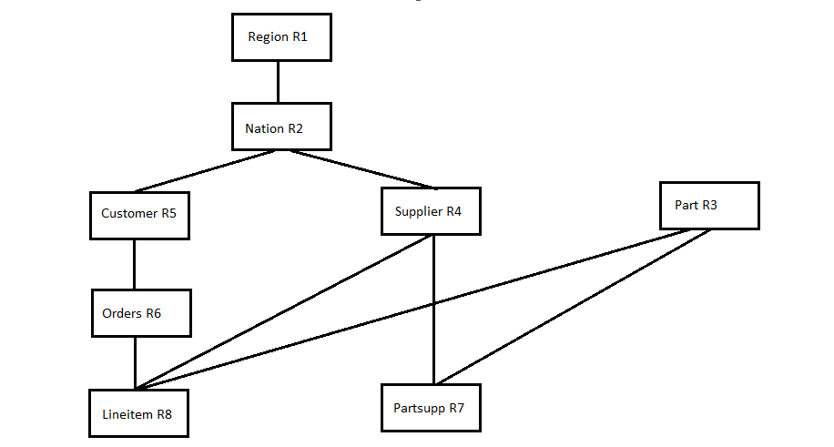
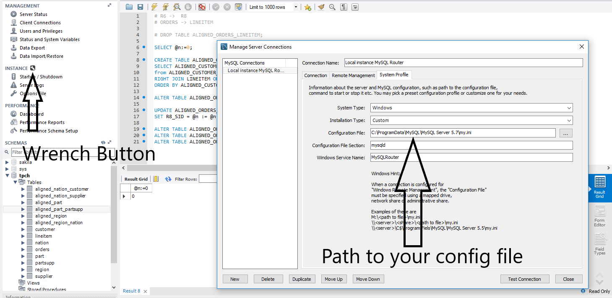
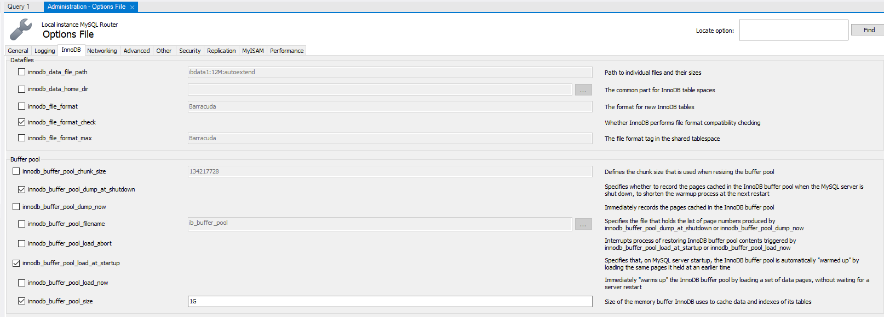
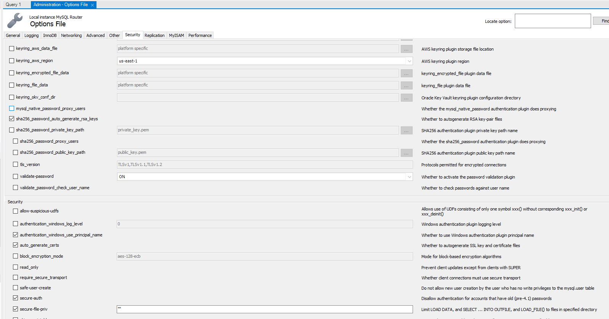
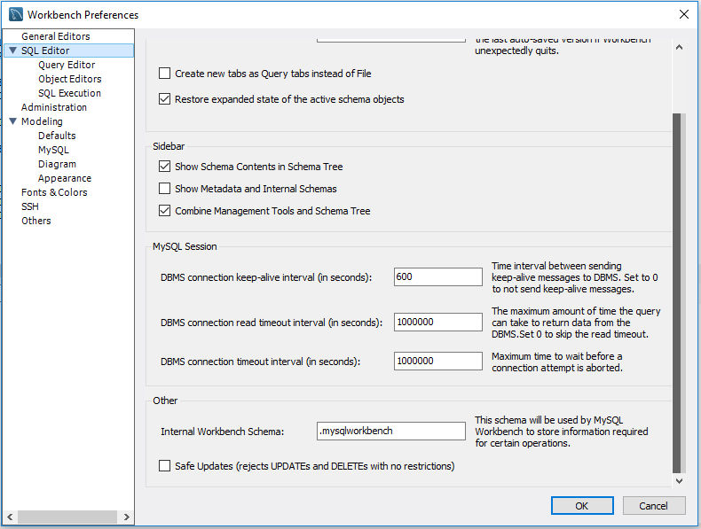
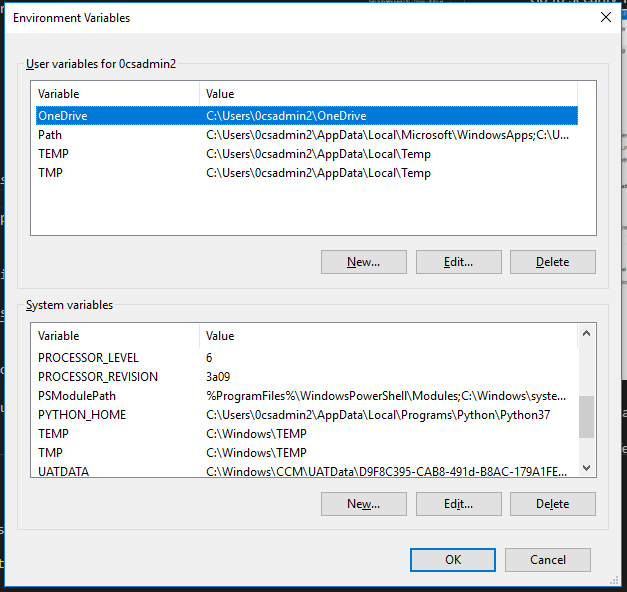
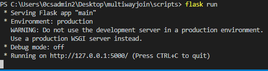
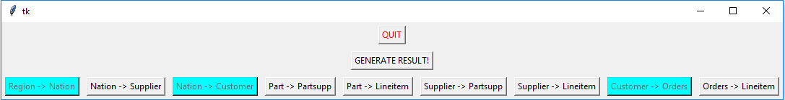
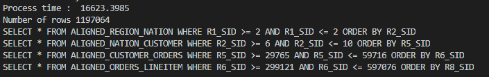

Multiway Join - Usage Guide
=================================================


<!-- TOC -->

- [Information](#information)
- [System Requirements](#system-requirements)
- [Software Requirements](#software-requirements)
- [Algorithm](#algorithm)
    - [Relation Overview](#relation-overview)
    - [Aligned Tables](#aligned-tables)
    - [Implementation](#implementation)
- [Project Setup](#project-setup)
    - [MySQL](#mysql)
        - [Creating the schema and tables](#creating-the-schema-and-tables)
        - [Loading DATA into Tables](#loading-data-into-tables)
        - [Creating Aligned Tables](#creating-aligned-tables)
        - [Altering SIDs in the aligned tables (Moving SIDs to 0th and 1st column)](#altering-sids-in-the-aligned-tables-moving-sids-to-0th-and-1st-column)
    - [Python](#python)
        - [pip](#pip)
        - [flask](#flask)
- [Project Execution](#project-execution)
- [Results](#results)
    - [Tabular Result](#tabular-result)

<!-- /TOC -->
## Information
``
Student Name: Avinash Sorab | 
DAWG Tag: siu854709544 |
Professor: Dr. Wen-Chi Hou
``

## System Requirements
 
The project was developed and tested on a laptop that had
- **RAM**: 4GB
- **HDD**: 320GB
- **Processor**: Core i5 
- **OS**: Windows 10 Pro

## Software Requirements

- **Visual Studio Code** - A light weight code editor that has command line integrated to it. Easy to write code, debugging as it enables us to install intellisense.  
https://code.visualstudio.com/

- **MySQL Installer 5.7.23** (Community Version)  
https://downloads.mysql.com/archives/installer/

Choose the product version from latest to 5.7.23

It'll let you install all the below softwares



- Make sure you've all these softwares installed below  
  Microsoft Visual C++ 2010 Redistributable (x86)  
  Microsoft Visual C++ 2010 Redistributable (x64)  
  Microsoft Visual C++ 2013 Redistributable (x86)  
  Microsoft Visual C++ 2013 Redistributable (x64)  
  Microsoft Visual C++ 2015 Redistributable (x86)  
  Microsoft Visual C++ 2015 Redistributable (x64)  

  to support all the softwares present in the installer.

- **Python 3.7.0**  
https://www.python.org/

- **Git 2.19.2.windows.1**  
https://git-scm.com/download/win

## Algorithm

### Relation Overview

The TPCH benchmark relation used for this is as below



### Aligned Tables

There are 11 aligned tables possible in this
- ALIGNED_REGION (R1)
- ALIGNED_NATION (R1 -> R2)
- ALIGNED_PART (R3)
- ALIGNED_SUPPLIER (R2 -> R4)
- ALIGNED_CUSTOMER (R2 -> R5)
- ALIGNED_ORDERS (R5 -> R6)
- ALIGNED_PARTSUPP (R4 -> R7, R3 -> R7)
- ALIGNED_LINEITEM (R4 -> R8, R3 -> R8)

### Implementation

- Create aligned tables
- Allow the user to select the relation he wants to create join on
- Ex: if the user selects REGION -> NATION -> SUPPLIER,  
for every single tuple of region, select all the nations and following suppliers which belong to that region (DFS)
- Send it through the log_linear_result function that compares the self_sid of one table with the parent_sid of another table,
- In the below example it compares r1_sid from aligned_region table with r1_sid from aligned_nation table and r2_sid from aligned_nation is compared with r2_sid in aligned_supplier, if they are equal, they'll be logged into a file


```
for tuple1 in aligned_region:  
    for tuple2 in aligned_nation:
        for tuple3 in aligned_supplier:
            if(tuple1[1] == tuple2[0] && tuple2[1] == tuple3[0]):
                log_to_file()
```


- For Divergent Graphs, such as REGION -> NATION -> (SUPPLIER, CUSTOMER), Identify the shortest branch,
- Implement linear join for the shortest branch,
then implement linear join for another branch and store the result
- Output the crossproduct of both the result.

## Project Setup

### MySQL

- Open MySQL WorkBench

- From the Main Menu -> Server -> Options File, if the file doesn't load
then click on the Wrench button beside Instance in the left pane

- A window pops up


After this you should be able to open the options file

- Increase the InnoDB Buffer Pool Size from 8M to 1G by going to 
Main Menu -> Server -> Options File -> InnoDB tab -> Check innodb_buffer_pool_size
and change it to 1G



- Go to Security Tab, scroll down till you find secure-file-priv,
check it if it's unchecked and set it to "" (blank string)


- Click on Apply and then close the window

- Disable the Safe Updates by going to Edit -> Preferences -> SQL Editor and scroll down and you'll find an option, uncheck it.




#### Creating the schema and tables

- Paste the below code to create schema and tables
```
# CREATE SCHEMA 

CREATE SCHEMA `TPCH`;

# CREATE TABLES

#R1
CREATE TABLE region (
	R_REGIONKEY	int PRIMARY KEY,
	R_NAME		CHAR(25),
	R_COMMENT	VARCHAR(152)
);

#R2
CREATE TABLE nation (
	N_NATIONKEY		int PRIMARY KEY,
	N_NAME			CHAR(25),
	N_REGIONKEY		BIGINT NOT NULL,  -- references R_REGIONKEY
	N_COMMENT		VARCHAR(152)
);

#R3
CREATE TABLE part (

	P_PARTKEY		int PRIMARY KEY,
	P_NAME			VARCHAR(55),
	P_MFGR			CHAR(25),
	P_BRAND			CHAR(10),
	P_TYPE			VARCHAR(25),
	P_SIZE			INTEGER,
	P_CONTAINER		CHAR(10),
	P_RETAILPRICE	DECIMAL,
	P_COMMENT		VARCHAR(23)
);

#R4
CREATE TABLE supplier (
	S_SUPPKEY		int PRIMARY KEY,
	S_NAME			CHAR(25),
	S_ADDRESS		VARCHAR(40),
	S_NATIONKEY		BIGINT NOT NULL, -- references N_NATIONKEY
	S_PHONE			CHAR(15),
	S_ACCTBAL		DECIMAL,
	S_COMMENT		VARCHAR(101)
);

#R5
CREATE TABLE customer (
	C_CUSTKEY		int PRIMARY KEY,
	C_NAME			VARCHAR(25),
	C_ADDRESS		VARCHAR(40),
	C_NATIONKEY		BIGINT NOT NULL, -- references N_NATIONKEY
	C_PHONE			CHAR(15),
	C_ACCTBAL		DECIMAL,
	C_MKTSEGMENT	CHAR(10),
	C_COMMENT		VARCHAR(117)
);

#R6
CREATE TABLE orders (
	O_ORDERKEY		int PRIMARY KEY,
	O_CUSTKEY		BIGINT NOT NULL, -- references C_CUSTKEY
	O_ORDERSTATUS	CHAR(1),
	O_TOTALPRICE	DECIMAL,
	O_ORDERDATE		DATE,
	O_ORDERPRIORITY	CHAR(15),
	O_CLERK			CHAR(15),
	O_SHIPPRIORITY	INTEGER,
	O_COMMENT		VARCHAR(79)
);

#R7
CREATE TABLE partsupp (
	PS_PARTKEY		BIGINT NOT NULL, -- references P_PARTKEY
	PS_SUPPKEY		BIGINT NOT NULL, -- references S_SUPPKEY
	PS_AVAILQTY		INTEGER,
	PS_SUPPLYCOST	DECIMAL,
	PS_COMMENT		VARCHAR(199),
	PRIMARY KEY (PS_PARTKEY, PS_SUPPKEY)
);

#R8
CREATE TABLE lineitem (
	L_ORDERKEY		BIGINT NOT NULL, -- references O_ORDERKEY
	L_PARTKEY		BIGINT NOT NULL, -- references P_PARTKEY (compound fk to PARTSUPP)
	L_SUPPKEY		BIGINT NOT NULL, -- references S_SUPPKEY (compound fk to PARTSUPP)
	L_LINENUMBER	INTEGER,
	L_QUANTITY		DECIMAL,
	L_EXTENDEDPRICE	DECIMAL,
	L_DISCOUNT		DECIMAL,
	L_TAX			DECIMAL,
	L_RETURNFLAG	CHAR(1),
	L_LINESTATUS	CHAR(1),
	L_SHIPDATE		DATE,
	L_COMMITDATE	DATE,
	L_RECEIPTDATE	DATE,
	L_SHIPINSTRUCT	CHAR(25),
	L_SHIPMODE		CHAR(10),
	L_COMMENT		VARCHAR(44),
	PRIMARY KEY (L_ORDERKEY, L_LINENUMBER)
);
```

#### Loading DATA into Tables

```
# TO LOAD THE DATA FROM TPCH TO WORKBENCH

LOAD DATA CONCURRENT INFILE 'D:\TPCH_1GB\\region.tbl'
INTO TABLE region
FIELDS TERMINATED BY '|' 
LINES TERMINATED BY '\n';

LOAD DATA CONCURRENT INFILE 'D:\TPCH_1GB\\nation.tbl'
INTO TABLE nation
FIELDS TERMINATED BY '|' 
LINES TERMINATED BY '\n';

LOAD DATA CONCURRENT INFILE 'D:\TPCH_1GB\\part.tbl'
INTO TABLE part 
FIELDS TERMINATED BY '|' 
LINES TERMINATED BY '\n';

LOAD DATA CONCURRENT INFILE 'D:\TPCH_1GB\\supplier.tbl'
INTO TABLE supplier
FIELDS TERMINATED BY '|' 
LINES TERMINATED BY '\n';

LOAD DATA CONCURRENT INFILE 'D:\TPCH_1GB\\customer.tbl'
INTO TABLE customer
FIELDS TERMINATED BY '|' 
LINES TERMINATED BY '\n';

LOAD DATA CONCURRENT INFILE 'D:\TPCH_1GB\\order.tbl'
INTO TABLE orders
FIELDS TERMINATED BY '|' 
LINES TERMINATED BY '\n';

LOAD DATA CONCURRENT INFILE 'D:\TPCH_1GB\\partsupp.tbl'
INTO TABLE partsupp 
FIELDS TERMINATED BY '|' 
LINES TERMINATED BY '\n';

LOAD DATA CONCURRENT INFILE 'D:\TPCH_1GB\\lineitem.tbl'
INTO TABLE lineitem
FIELDS TERMINATED BY '|' 
LINES TERMINATED BY '\n';
```

#### Creating Aligned Tables

```
# R1
# REGION


# DROP TABLE ALIGNED_REGION;

CREATE TABLE ALIGNED_REGION
SELECT * FROM REGION;

ALTER TABLE ALIGNED_REGION ADD R1_SID
INTEGER PRIMARY KEY AUTO_INCREMENT;


# R1 -> R2
# REGION -> NATION

DROP TABLE ALIGNED_REGION_NATION;

SELECT @n:=0;

CREATE TABLE ALIGNED_REGION_NATION
SELECT ALIGNED_REGION.R1_SID, NATION.*
FROM ALIGNED_REGION
RIGHT JOIN NATION ON ALIGNED_REGION.R_REGIONKEY = NATION.N_REGIONKEY
ORDER BY ALIGNED_REGION.R1_SID;

ALTER TABLE ALIGNED_REGION_NATION ADD R2_SID INTEGER;

UPDATE ALIGNED_REGION_NATION
SET R2_SID = @n := @n + 1;

ALTER TABLE ALIGNED_REGION_NATION ADD PRIMARY KEY(N_NATIONKEY);
ALTER TABLE ALIGNED_REGION_NATION ADD KEY(R1_SID);
ALTER TABLE ALIGNED_REGION_NATION ADD UNIQUE KEY(R2_SID);


# R2 -> R4
# NATION -> SUPPLIER

DROP TABLE ALIGNED_NATION_SUPPLIER;

SELECT @n:=0;

CREATE TABLE ALIGNED_NATION_SUPPLIER
SELECT ALIGNED_REGION_NATION.R2_SID, SUPPLIER.*
FROM ALIGNED_REGION_NATION
RIGHT JOIN SUPPLIER ON ALIGNED_REGION_NATION.N_NATIONKEY = SUPPLIER.S_NATIONKEY
ORDER BY ALIGNED_REGION_NATION.R2_SID;

ALTER TABLE ALIGNED_NATION_SUPPLIER ADD R4_SID INTEGER;

UPDATE ALIGNED_NATION_SUPPLIER
SET R4_SID = @n := @n + 1;

ALTER TABLE ALIGNED_NATION_SUPPLIER ADD PRIMARY KEY(S_SUPPKEY);
ALTER TABLE ALIGNED_NATION_SUPPLIER  ADD KEY(R2_SID);
ALTER TABLE ALIGNED_NATION_SUPPLIER ADD UNIQUE KEY(R4_SID);


# R2 -> R5
# NATION -> CUSTOMER

DROP TABLE ALIGNED_NATION_CUSTOMER;

SELECT @n:=0;

CREATE TABLE ALIGNED_NATION_CUSTOMER
SELECT ALIGNED_REGION_NATION.R2_SID, CUSTOMER.*
FROM ALIGNED_REGION_NATION
RIGHT JOIN CUSTOMER ON ALIGNED_REGION_NATION.N_NATIONKEY = CUSTOMER.C_NATIONKEY
ORDER BY ALIGNED_REGION_NATION.R2_SID;

ALTER TABLE ALIGNED_NATION_CUSTOMER ADD R5_SID INTEGER;

UPDATE ALIGNED_NATION_CUSTOMER
SET R5_SID = @n := @n + 1;

ALTER TABLE ALIGNED_NATION_CUSTOMER ADD PRIMARY KEY(C_CUSTKEY);
ALTER TABLE ALIGNED_NATION_CUSTOMER  ADD KEY(R2_SID);
ALTER TABLE ALIGNED_NATION_CUSTOMER ADD UNIQUE KEY(R5_SID);


# R3
# PART

# DROP TABLE ALIGNED_PART;

CREATE TABLE ALIGNED_PART
SELECT * FROM PART;

ALTER TABLE ALIGNED_PART ADD R3_SID
INTEGER PRIMARY KEY AUTO_INCREMENT;


# R3 -> R7
# PART -> PARTSUPP

DROP TABLE ALIGNED_PART_PARTSUPP;

SELECT @n:=0;

CREATE TABLE ALIGNED_PART_PARTSUPP
SELECT ALIGNED_PART.R3_SID, PARTSUPP.*
FROM ALIGNED_PART
RIGHT JOIN PARTSUPP ON ALIGNED_PART.P_PARTKEY = PARTSUPP.PS_PARTKEY
ORDER BY ALIGNED_PART.R3_SID;

ALTER TABLE ALIGNED_PART_PARTSUPP ADD R7_SID INTEGER;

UPDATE ALIGNED_PART_PARTSUPP
SET R7_SID = @n := @n + 1;

ALTER TABLE ALIGNED_PART_PARTSUPP ADD PRIMARY KEY(PS_PARTKEY, PS_SUPPKEY);
ALTER TABLE ALIGNED_PART_PARTSUPP ADD KEY(R3_SID);
ALTER TABLE ALIGNED_PART_PARTSUPP ADD UNIQUE KEY(R7_SID);


# R3 ->  R8
# PART -> LINEITEM

DROP TABLE ALIGNED_PART_LINEITEM;

SELECT @n:=0;

CREATE TABLE ALIGNED_PART_LINEITEM
SELECT ALIGNED_PART.R3_SID, LINEITEM.*
from ALIGNED_PART
RIGHT JOIN LINEITEM ON ALIGNED_PART.P_PARTKEY = LINEITEM.L_PARTKEY
ORDER BY ALIGNED_PART.R3_SID;

ALTER TABLE ALIGNED_PART_LINEITEM ADD R8_SID INTEGER;

UPDATE ALIGNED_PART_LINEITEM
SET R8_SID = @n := @n + 1;

ALTER TABLE ALIGNED_PART_LINEITEM ADD PRIMARY KEY(L_ORDERKEY, L_LINENUMBER);
ALTER TABLE ALIGNED_PART_LINEITEM ADD KEY(R3_SID);
ALTER TABLE ALIGNED_PART_LINEITEM ADD UNIQUE KEY(R8_SID);


# R4 -> R7
# SUPPLIER -> PARTSUPP

DROP TABLE ALIGNED_SUPPLIER_PARTSUPP;

SELECT @n:=0;

CREATE TABLE ALIGNED_SUPPLIER_PARTSUPP
SELECT ALIGNED_NATION_SUPPLIER.R4_SID, PARTSUPP.*
from ALIGNED_NATION_SUPPLIER
RIGHT JOIN PARTSUPP ON ALIGNED_NATION_SUPPLIER.S_SUPPKEY = PARTSUPP.PS_SUPPKEY
ORDER BY ALIGNED_NATION_SUPPLIER.R4_SID;

ALTER TABLE ALIGNED_SUPPLIER_PARTSUPP ADD R7_SID INTEGER;

UPDATE ALIGNED_SUPPLIER_PARTSUPP
SET R7_SID = @n := @n + 1;

ALTER TABLE ALIGNED_SUPPLIER_PARTSUPP ADD PRIMARY KEY(PS_PARTKEY, PS_SUPPKEY);
ALTER TABLE ALIGNED_SUPPLIER_PARTSUPP ADD KEY(R4_SID);
ALTER TABLE ALIGNED_SUPPLIER_PARTSUPP ADD UNIQUE KEY(R7_SID);


# R4 ->  R8
# SUPPLIER -> LINEITEM

DROP TABLE ALIGNED_SUPPLIER_LINEITEM;

SELECT @n:=0;

CREATE TABLE ALIGNED_SUPPLIER_LINEITEM
SELECT ALIGNED_NATION_SUPPLIER.R4_SID, LINEITEM.*
from ALIGNED_NATION_SUPPLIER
RIGHT JOIN LINEITEM ON ALIGNED_NATION_SUPPLIER.S_SUPPKEY = LINEITEM.L_SUPPKEY
ORDER BY ALIGNED_NATION_SUPPLIER.R4_SID;

ALTER TABLE ALIGNED_SUPPLIER_LINEITEM ADD R8_SID INTEGER;

UPDATE ALIGNED_SUPPLIER_LINEITEM
SET R8_SID = @n := @n + 1;

ALTER TABLE ALIGNED_SUPPLIER_LINEITEM ADD PRIMARY KEY(L_ORDERKEY, L_LINENUMBER);
ALTER TABLE ALIGNED_SUPPLIER_LINEITEM ADD KEY(R4_SID);
ALTER TABLE ALIGNED_SUPPLIER_LINEITEM ADD UNIQUE KEY(R8_SID);


# R5 -> R6
# CUSTOMER -> ORDERS

DROP TABLE ALIGNED_CUSTOMER_ORDERS;

SELECT @n:=0;

CREATE TABLE ALIGNED_CUSTOMER_ORDERS
SELECT ALIGNED_NATION_CUSTOMER.R5_SID, ORDERS.*
FROM ALIGNED_NATION_CUSTOMER
RIGHT JOIN ORDERS ON ALIGNED_NATION_CUSTOMER.C_CUSTKEY = ORDERS.O_CUSTKEY
ORDER BY ALIGNED_NATION_CUSTOMER.R5_SID;

ALTER TABLE ALIGNED_CUSTOMER_ORDERS ADD R6_SID INTEGER;

UPDATE ALIGNED_CUSTOMER_ORDERS
SET R6_SID = @n := @n + 1;

ALTER TABLE ALIGNED_CUSTOMER_ORDERS ADD PRIMARY KEY(O_ORDERKEY);
ALTER TABLE ALIGNED_CUSTOMER_ORDERS ADD KEY(R5_SID);
ALTER TABLE ALIGNED_CUSTOMER_ORDERS ADD UNIQUE KEY(R6_SID);


# R6 ->  R8
# ORDERS -> LINEITEM

SELECT @n:=0;

# DROP TABLE ALIGNED_ORDERS_LINEITEM;

CREATE TABLE ALIGNED_ORDERS_LINEITEM
SELECT ALIGNED_CUSTOMER_ORDERS.R6_SID, LINEITEM.*
from ALIGNED_CUSTOMER_ORDERS
RIGHT JOIN LINEITEM ON ALIGNED_CUSTOMER_ORDERS.O_ORDERKEY = LINEITEM.L_ORDERKEY
ORDER BY ALIGNED_CUSTOMER_ORDERS.R6_SID;

ALTER TABLE ALIGNED_ORDERS_LINEITEM ADD R8_SID INTEGER;

UPDATE ALIGNED_ORDERS_LINEITEM
SET R8_SID = @n := @n + 1;

ALTER TABLE ALIGNED_ORDERS_LINEITEM ADD PRIMARY KEY(L_ORDERKEY, L_LINENUMBER);
ALTER TABLE ALIGNED_ORDERS_LINEITEM ADD KEY(R6_SID);
ALTER TABLE ALIGNED_ORDERS_LINEITEM ADD UNIQUE KEY(R8_SID);
```

#### Altering SIDs in the aligned tables (Moving SIDs to 0th and 1st column)
```
# MOVING THE SELF_SIDS AFTER PARENT_SIDS

ALTER TABLE ALIGNED_REGION MODIFY COLUMN R1_SID INTEGER AFTER R_REGIONKEY;
ALTER TABLE ALIGNED_PART MODIFY COLUMN R3_SID INTEGER AFTER P_PARTKEY;
ALTER TABLE ALIGNED_REGION_NATION MODIFY COLUMN R2_SID INTEGER AFTER R1_SID;
ALTER TABLE ALIGNED_NATION_SUPPLIER MODIFY COLUMN R4_SID INTEGER AFTER R2_SID;
ALTER TABLE ALIGNED_NATION_CUSTOMER MODIFY COLUMN R5_SID INTEGER AFTER R2_SID;
ALTER TABLE ALIGNED_CUSTOMER_ORDERS MODIFY COLUMN R6_SID INTEGER AFTER R5_SID;
ALTER TABLE ALIGNED_ORDERS_LINEITEM MODIFY COLUMN R8_SID INTEGER AFTER R6_SID;
ALTER TABLE ALIGNED_SUPPLIER_PARTSUPP MODIFY COLUMN R7_SID INTEGER AFTER R4_SID;
ALTER TABLE ALIGNED_SUPPLIER_LINEITEM MODIFY COLUMN R8_SID INTEGER AFTER R4_SID;
ALTER TABLE ALIGNED_PART_PARTSUPP MODIFY COLUMN R7_SID INTEGER AFTER R3_SID;
ALTER TABLE ALIGNED_PART_LINEITEM MODIFY COLUMN R8_SID INTEGER AFTER R3_SID;
```


### Python

After you install python, add python to the ENVIROMENT_VARIABLES in your windows system.

- On your Windows machine, go to *System Properties* -> *Advanced Tab* -> *Environment Variables*



You can verify this by opening cmd from anywhere and type python to see if python command line opens up.


You need pip to install most of the python tools

#### pip

- You can download the code **get-pip.py** from the below link.  
https://bootstrap.pypa.io/get-pip.py  
and run it on python command line  

- Navigate to the location where you've downloaded get-pip.py file.

```
> python get-pip.py
```
- It will download and install pip

- Put python and pip executables into a common location  
**C:\Python\Scripts**  
and add this to the environment variables list so that pip can be run from anywhere

- Verify by typing
```
> pip freeze
```
from anywhere in the window.

#### flask

- Install flask, the GUI tool that's required to get inputs from the User and show aligned relations

```
> pip install flask
```

- Clone the project from the below link into your system.  
```
> git clone https://github.com/avinashsp93/multiwayjoin.git
```

- Open the folder in Visual Studio Code, Press **Ctrl + `**

- Install some important plugins required
```
> pip3 install pandas
> pip3 install mysql-connector-python-rf
```

- Navigate to the .\scripts folder
```
> cd .\scripts
```

- Set the FLASK_APP environment variable
```
> $env:FLASK_APP="main"
```

## Project Execution

- Navigate to your project where you've cloned, using commandline

- Run the below command from the commandline
```
> flask run
```
You should be getting below output



Click on the link http://127.0.0.1:5000/
and open it in chrome browser

- At this state if you refresh the server, you'll be getting a new tkinter window
where the user can specify inputs

**Input**



- The highlighted cyan color indicates the aligned relation that's going to be created

- Click on **Generate Result** button and head back to command line

**Output**



**Print File**

The first few rows


The last few rows


## Results

### Tabular Result

| Relation              | Time          | File Size | Number of Rows    |
|-----------------------|---------------|-----------|-------------------|
| R -> N                | 0.02sec       | 5kB       | 25                |
| R -> N -> S           | 0.5299sec     | 3235kB    | 10000             |
| R -> N -> C           | 8.1313sec     | 51846kB   | 150000            |
| R -> N -> C -> O      | 1991.81sec    | 698625kB  | 1500000           |
| R -> N -> S -> PS     | 113.0356sec   | 380113kB  | 800000            |
| R -> N -> C -> O -> L | 83487.59sec   | 2543871kB | 6000000           |
| N -> S                | 0.5097sec     | 2302kB    | 10000             |
| N -> C                | 7.1866sec     | 37855kB   | 150000            |
| N -> S -> PS          | 49.8817sec    | 305503kB  | 800000            |
| N -> C -> O           | 492.17sec     | 558689kB  | 1500000           |
| S -> PS               | 433.3983sec   | 2350kB    | 800000            |

