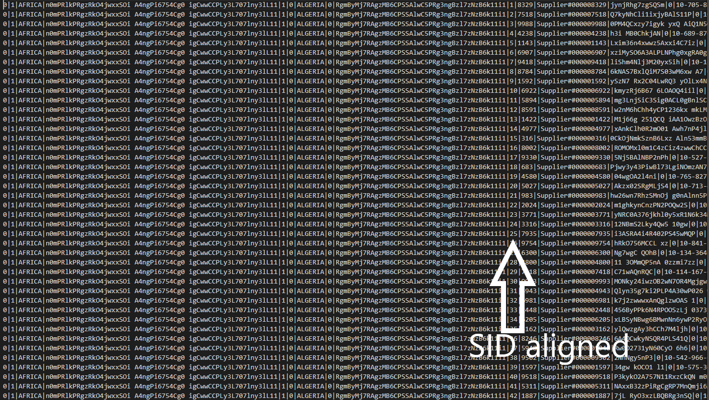

Multiway Join - Usage Guide
=================================================

<!-- TOC -->

- [System Requirements](#system-requirements)
- [Software Requirements](#software-requirements)
- [Project Setup](#project-setup)
    - [MySQL](#mysql)
    - [Python](#python)
        - [pip](#pip)
        - [flask](#flask)
- [Project Execution](#project-execution)
- [Results](#results)
    - [Tabular Result](#tabular-result)

<!-- /TOC -->

## System Requirements

The project was developed and tested on a laptop that had
- **RAM**: 4GB
- **HDD**: 320GB
- **Processor**: Core i5 
- **OS**: Windows 10 Pro

## Software Requirements

- **Visual Studio Code** - A light weight code editor that has command line integrated to it. Easy to write code, debugging as it enables us to install intellisense.  
https://code.visualstudio.com/

- **MySQL Installer 5.7.23** (Community Version)  
https://downloads.mysql.com/archives/installer/

Choose the product version from latest to 5.7.23

It'll let you install all the below softwares


- Make sure you've all these softwares installed below  
  Microsoft Visual C++ 2010 Redistributable (x86)  
  Microsoft Visual C++ 2010 Redistributable (x64)  
  Microsoft Visual C++ 2013 Redistributable (x86)  
  Microsoft Visual C++ 2013 Redistributable (x64)  
  Microsoft Visual C++ 2015 Redistributable (x86)  
  Microsoft Visual C++ 2015 Redistributable (x64)  

  to support all the softwares present in the installer.

- **Python 3.7.0**  
https://www.python.org/

- **Git 2.19.2.windows.1**  
https://git-scm.com/download/win

## Project Setup

### MySQL

- Open MySQL WorkBench

- From the Main Menu -> Server -> Options File, if the file doesn't load
then click on the Wrench button beside Instance in the left pane

- A window pops up


After this you should be able to open the options file

- Increase the InnoDB Buffer Pool Size from 8M to 1G by going to 
Main Menu -> Server -> Options File -> InnoDB tab -> Check innodb_buffer_pool_size
and change it to 1G


- Go to Security Tab, scroll down till you find secure-file-priv,
check it if it's unchecked and set it to "" (blank string)


- Click on Apply and then close the window

- Disable the Safe Updates by going to Edit -> Preferences -> SQL Editor and scroll down and you'll find an option, uncheck it.


### Python

After you install python, add python to the ENVIROMENT_VARIABLES in your windows system.

- On your Windows machine, go to *System Properties* -> *Advanced Tab* -> *Environment Variables*


You can verify this by opening cmd from anywhere and type python to see if python command line opens up.


You need pip to install most of the python tools

#### pip

- You can download the code **get-pip.py** from the below link.  
https://bootstrap.pypa.io/get-pip.py  
and run it on python command line  

- Navigate to the location where you've downloaded get-pip.py file.

```
> python get-pip.py
```
- It will download and install pip

- Put python and pip executables into a common location  
**C:\Python\Scripts**  
and add this to the environment variables list so that pip can be run from anywhere

- Verify by typing
```
> pip freeze
```
from anywhere in the window.

#### flask

- Install flask, the GUI tool that's required to get inputs from the User and show aligned relations

```
> pip install flask
```

- Clone the project from the below link into your system.  
```
> git clone https://github.com/avinashsp93/multiwayjoin.git
```

- Open the folder in Visual Studio Code, Press **Ctrl + `**

- Install some important plugins required
```
> pip3 install pandas
> pip3 install mysql-connector-python-rf
```

- Navigate to the .\scripts folder
```
> cd .\scripts
```

- Set the FLASK_APP environment variable
```
> $env:FLASK_APP="main"
```

## Project Execution

- Navigate to your project where you've cloned, using commandline

- Run the below command from the commandline
```
> flask run
```
You should be getting below output


Click on the link http://127.0.0.1:5000/
and open it in chrome browser

- At this state if you refresh the server, you'll be getting a new tkinter window
where the user can specify inputs

**Input**


- The highlighted cyan color indicates the aligned relation that's going to be created

- Click on **Generate Result** button and head back to command line

**Output**


**Print File**

The first few rows



The last few rows


## Results

### Tabular Result

| Relation              | Time          | File Size | Number of Rows    |
|-----------------------|---------------|-----------|-------------------|
| R -> N                | 0.02sec       | 5kB       | 25                |
| R -> N -> S           | 0.5299sec     | 3235kB    | 10000             |
| R -> N -> C           | 8.1313sec     | 51846kB   | 150000            |
| R -> N -> C -> O      | 1991.81sec    | 698625kB  | 1500000           |
| R -> N -> S -> PS     | 113.0356sec   | 380113kB  | 800000            |
| R -> N -> C -> O -> L | 83487.59sec   | 2543871kB | 6000000           |
| N -> S                | 0.5097sec     | 2302kB    | 10000             |
| N -> C                | 7.1866sec     | 37855kB   | 150000            |
| N -> S -> PS          | 49.8817sec    | 305503kB  | 800000            |
| N -> C -> O           | 492.17sec     | 558689kB  | 1500000           |
| S -> PS               | 433.3983sec   | 2350kB    | 800000            |